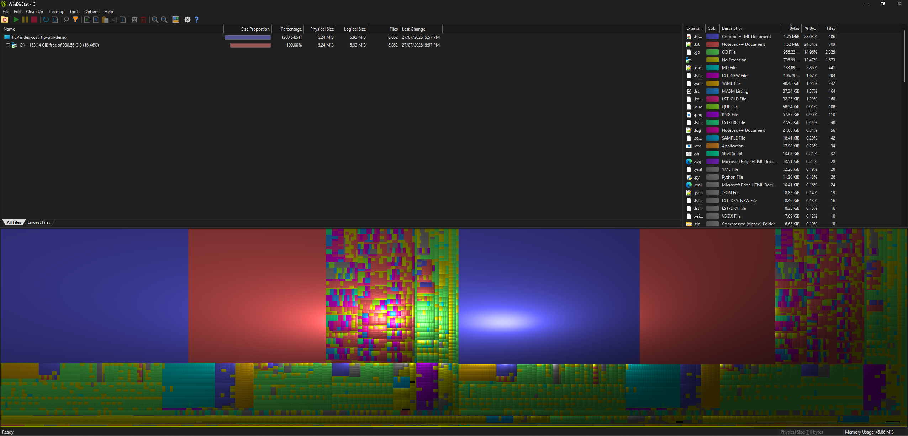

# flp-util
See what's inside a [FileLocator Pro](https://www.mythicsoft.com/filelocatorpro/) index — export the full file list to CSV, and find out which files and folders are taking up the most index space.

## Download
A portable executable for Windows can be found over in the [releases](https://github.com/fiddyschmitt/flp-util/releases/latest) section.

To build from source instead, run `build.cmd` (requires the .NET 10 SDK).

<br />

## Export an index to CSV

`flp-util export --name "My Index" --out files.csv`

Exports every indexed file with all of its metadata — full path, size, timestamps, term count, and whether its content was indexed.

<br />

## Which folders cost the most?

`flp-util index cost --name "My Index" --by-folder`

Ranks folders by how many index bytes their contents are responsible for. Useful for finding things worth excluding — for example a folder of logs full of effectively random numbers, which is expensive to index and useless to search.

```
         subtree      exclusive    files  folder
       6,256,757      5,943,737    5,247  C:\...\dev\go\rclone
       3,156,509      2,987,564    2,650  C:\...\dev\go\rclone\rclone
         659,385        635,720    1,110  C:\...\dev\go\rclone\rclone\cmd
```

`exclusive` is what you'd actually get back by excluding that folder from the index.

<br />

## Visualise in WinDirStat

`flp-util index treemap --name "My Index" --out cost.csv --open`

Writes a file that [WinDirStat](https://windirstat.net/) 2.x can load, so its treemap shows index bytes instead of disk bytes. Content indexed *inside* files — zip archives, Outlook PST/MSG — shows up as folders you can drill into.



`--open` launches WinDirStat automatically (set `WINDIRSTAT_PATH` if you use a portable copy, or load the file manually with `WinDirStat.exe /loadfrom cost.csv`).

`Physical Size` holds the index bytes and drives the treemap; `Logical Size` holds the plain file size, so toggling WinDirStat's *logical size* option flips the same tree into a familiar disk-usage view. Anything whose index cost rivals its file size is expensive to index for what it is.

<br />

## Other commands

```
flp-util index list                       the indexes FileLocator Pro knows about
flp-util index info   --name <index>      document counts and schema of an index store
flp-util index dump   --name <index>      print raw index documents, uninterpreted
flp-util index values --name <index>      distinct values of one field, decoded
flp-util wds validate --file <file.csv>   check any WinDirStat results file against the
                                          loader's real rules (WinDirStat itself just
                                          opens empty or crashes on a bad file)
```

Every command also accepts `--path <folder>` to open an index store directly, and `--quiet` to suppress progress.

<br />

## How does it work?
FileLocator Pro's indexer is built on Lucene++, so an index store is a standard Lucene 3.0 index. flp-util reads it directly and read-only — safe to run while FLP is indexing. It rebuilds the folder tree that FLP stores in normalised form, then models the on-disk format byte-for-byte so every file can be charged the exact bytes it contributes; the totals reconcile against the real store size.

The reverse-engineered details (FLP's field encodings, the byte attribution model, WinDirStat's undocumented loader rules) are written up in [docs/internals.md](docs/internals.md).

## Thanks
Thanks to Mythicsoft for [FileLocator Pro](https://www.mythicsoft.com/filelocatorpro/), the [WinDirStat team](https://github.com/windirstat/windirstat) for the treemap this piggybacks on, and the [Apache Lucene.NET](https://lucenenet.apache.org/) project for the Lucene 3.x codec.
